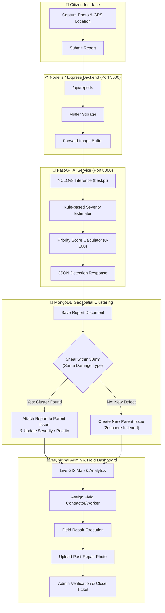

# 🛣️ RoadWise — Smart Road Damage Intelligence & Municipal Management Platform

> **Smart India Hackathon 2026** | Theme: *Smart Automation / Transportation & Smart Cities* | Category: *Software*

[](https://github.com/ultralytics/ultralytics)
[](https://fastapi.tiangolo.com)
[](https://expressjs.com)
[](https://www.mongodb.com)
[](https://react.dev)
[](https://leafletjs.com)

---

## 📌 Overview

**RoadWise** is an end-to-end civic-tech platform that automates the reporting, detection, severity assessment, duplicate clustering, and resolution lifecycle of hazardous road defects (*potholes, open manholes, surface cracks, road distress*).

By combining **citizen crowdsourcing**, **real-time computer vision (YOLOv8)**, and **geospatial proximity clustering (MongoDB 2dsphere)**, RoadWise bridges the gap between commuters and municipal corporations (ULBs / PWD / NHAI) to build safer, smarter, and more accountable urban road infrastructure.

---

## ⚡ Key Highlights & Core Innovations

- 🔍 **Real-Time Computer Vision Inference:** Sub-second detection of potholes and open manholes using an optimized **Ultralytics YOLOv8** model served via **FastAPI**.
- 📍 **Smart 30m Geospatial Clustering:** Groups multiple citizen submissions for the same physical road defect into a single parent **Issue** using native MongoDB `2dsphere` spatial indexing (`$near`), completely eliminating ticket redundancy while retaining full citizen audit trails.
- 🎯 **Dynamic 0–100 Priority Scoring:** Combines hazard classification risk with bounding-box surface area ratio to mathematically prioritize emergency repairs without human bias.
- 🗺️ **Interactive GIS Municipal Dashboard:** Powered by **Leaflet.js** and **OpenStreetMap**, offering color-coded heatmaps, cluster pins, and multi-zone triage.
- 🏛️ **Closed-Loop Field Verification:** Transparent role-based lifecycle (`Reported ➔ Verified ➔ Assigned ➔ In Progress ➔ Completed`) with **mandatory post-repair photographic proof** before ticket closure.
- 📱 **Zero-Install Web/PWA Experience:** Citizens report defects in seconds via standard mobile browsers with automatic HTML5 high-accuracy GPS geotagging.

---

## 🏗️ System Architecture



---

## 🧠 AI & Analytical Scoring Pipeline

### 1. Visual Severity Estimation
Severity is calculated dynamically based on the percentage of image area occupied by the defect bounding box ($A_{\text{ratio}} = \frac{\text{Box Area}}{\text{Image Area}} \times 100$):

| Hazard Type | Area Ratio ($A_{\text{ratio}}$) | Severity Level | Rationale |
| :--- | :--- | :--- | :--- |
| **Open Manhole** | $> 3.0\%$ | `high` | Severe immediate fatal hazard risk |
| **Open Manhole** | $\le 3.0\%$ | `medium` | High hazard even at smaller visual scale |
| **Pothole** | $< 2.5\%$ | `low` | Minor road surface depression |
| **Pothole** | $2.5\% \le A_{\text{ratio}} < 7.0\%$ | `medium` | Moderate vehicle impact risk |
| **Pothole** | $\ge 7.0\%$ | `high` | Deep/wide structural road collapse hazard |

### 2. Priority Score Formula ($0 - 100$)
$$\text{Priority Score} = \min(100, \text{Base Hazard Weight} + \text{Severity Multiplier} + (\text{Confidence} \times 5))$$

- **Base Weights:** `open_manhole` = $50$, `pothole` = $30$, `other` = $20$
- **Severity Multipliers:** `low` = $15$, `medium` = $30$, `high` = $45$
- **Confidence Boost:** Up to $+5$ points for high model confidence ($\ge 90\%$).

---

## 📂 Project Structure

```text
roadwise-sih-2026/
├── ai/                              # FastAPI Microservice & YOLOv8 Inference
│   ├── models/
│   │   └── best.pt                  # Trained YOLOv8 road defect weights
│   ├── main.py                      # FastAPI inference API & scoring engine
│   └── requirements.txt             # Python dependencies
│
├── backend/                         # Express.js REST API & Database Layer
│   ├── config/
│   │   └── db.js                    # Mongoose connection & 2dsphere index initialization
│   ├── controllers/
│   │   ├── ai.controller.js         # Bridge controller for AI service
│   │   ├── issue.controller.js      # Issue aggregation & details controller
│   │   └── report.controller.js     # Report intake & 30m clustering engine
│   ├── models/
│   │   ├── assignment.model.js      # Worker repair assignment schema
│   │   ├── issue.model.js           # Clustered defect parent entity with 2dsphere index
│   │   ├── report.model.js          # Individual citizen submission schema
│   │   ├── user.model.js            # Authentication & role-based user model
│   │   └── verification.model.js    # Post-repair photo verification schema
│   ├── routes/
│   │   ├── ai.routes.js             # /api/ai endpoints
│   │   ├── issue.routes.js          # /api/issues endpoints
│   │   └── report.routes.js         # /api/reports endpoints
│   ├── uploads/                     # Uploaded citizen & repair proof images
│   ├── server.js                    # Express app entrypoint & admin lifecycle routes
│   └── package.json
│
├── frontend/                        # React 19 + Vite Web Application
│   ├── src/
│   │   ├── components/
│   │   │   └── citizen/             # Hero, Navbar, ReportForm, HowItWorks, Stats, CTA
│   │   ├── pages/
│   │   │   ├── citizen/Home.jsx     # Citizen crowdsourced reporting landing page
│   │   │   └── admin/               # Municipal Dashboard, GIS Map, Triage, Details
│   │   ├── services/api.js          # Axios API client
│   │   ├── App.jsx                  # React Router routes
│   │   └── main.jsx
│   └── package.json
│
└── README.md
```

---

## 🔌 API Reference

### AI Microservice (`FastAPI` — Port `8000`)
| Method | Endpoint | Description |
| :--- | :--- | :--- |
| `POST` | `/predict` | Multipart image upload returning damage type, bounding boxes, severity & priority score |

### Backend API (`Express` — Port `3000`)

#### Citizen & AI Endpoints
| Method | Endpoint | Description |
| :--- | :--- | :--- |
| `POST` | `/api/reports` | Submit damage photo + GPS coords; triggers AI inference & 30m geospatial clustering |
| `GET` | `/api/reports` | Fetch list of all individual citizen reports |
| `POST` | `/api/ai/predict` | Direct AI test endpoint forwarding image to FastAPI |

#### Smart Issue Management
| Method | Endpoint | Description |
| :--- | :--- | :--- |
| `GET` | `/api/issues` | Fetch all deduplicated/clustered parent issues with child reports |
| `GET` | `/api/issues/:id` | Fetch single issue details with supporting citizen report history |

#### Municipal Admin & Lifecycle Operations
| Method | Endpoint | Description |
| :--- | :--- | :--- |
| `GET` | `/admin/dashboard` | Aggregated defect metrics (total, reported, in-progress, verified, high-severity) |
| `GET` | `/admin/reports` | All reports sorted by priority score |
| `GET` | `/admin/reports/priority` | Critical reports with priority score $\ge 70$ |
| `PUT` | `/admin/reports/:id/assign` | Assign repair ticket to a municipal contractor/worker |
| `PUT` | `/admin/reports/:id/in-progress` | Transition ticket status to in-progress |
| `PUT` | `/admin/reports/:id/complete` | Submit post-repair completion image proof |
| `POST` | `/admin/reports/:id/verify` | Municipal authority approval or rejection of repair quality |
| `POST` | `/auth/register` | Register citizen / admin / officer accounts |
| `POST` | `/auth/login` | Account authentication |

---

## 🚀 Getting Started

### Prerequisites
- **Node.js** (v18+)
- **Python** (v3.10+)
- **MongoDB** (Local instance or MongoDB Atlas cluster with `2dsphere` index support)

---

### 1. Setup AI Inference Microservice
```bash
cd ai

# Create and activate virtual environment
python -m venv venv
# Windows:
.\venv\Scripts\activate
# Linux/macOS:
# source venv/bin/activate

# Install dependencies
pip install -r requirements.txt
pip install ultralytics pillow

# Start FastAPI server
uvicorn main:app --host 0.0.0.0 --port 8000 --reload
```
*The AI API will be accessible at `http://localhost:8000/docs`.*

---

### 2. Setup Node.js / Express Backend
```bash
cd backend

# Install dependencies
npm install

# Create environment file
# Create a .env file in backend/ with:
# MONGO_URI=mongodb://localhost:27017/roadwise
# PORT=3000
# AI_SERVICE_URL=http://localhost:8000

# Start backend server
npm start
```
*The Backend API will run on `http://localhost:3000`.*

---

### 3. Setup React + Vite Frontend
```bash
cd frontend

# Install dependencies
npm install

# Start Vite development server
npm run dev
```
*The Frontend will be running at `http://localhost:5173`.*

---

## ⚙️ Environment Variables

Create a `backend/.env` file with the following configuration:

```env
# Server Port
PORT=3000

# MongoDB Database Connection String
MONGO_URI=mongodb://localhost:27017/roadwise

# FastAPI AI Service Endpoint
AI_SERVICE_URL=http://localhost:8000
```

---

## 🛡️ Resolution Workflow

```text
[Citizen Report] ➔ [YOLOv8 Detection] ➔ [30m Geo-Clustering] ➔ [Admin Triage]
                                                                     │
[Closed / Resolved] 🠔 [Admin Photo Verification] 🠔 [Field Repair] 🠔 [Assigned to Worker]
```

1. **Crowdsourced Capture:** Citizen takes a photo of road damage via mobile browser. HTML5 Geolocation attaches GPS coordinates.
2. **AI Analysis:** YOLOv8 detects damage bounding boxes, sets severity (`low`/`medium`/`high`), and computes priority score ($0-100$).
3. **Smart Clustering:** MongoDB checks for identical defect types within $30\text{ meters}$. If found, the submission is clustered under an existing **Issue** to eliminate ticket duplication.
4. **Assignment & Repair:** Municipal administrators review GIS heatmap, prioritize high-risk hazards, and dispatch field teams.
5. **Photographic Verification:** Contractors upload post-repair photos. Municipal authorities inspect the before/after images before marking the issue as `verified` and closing the ticket.

---

## 👥 Smart India Hackathon 2026

- **Project:** RoadWise
- **Domain:** Smart Automation / Smart Cities / Transportation
- **Category:** Software
- **License:** ISC